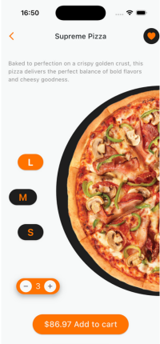

# 🍕 Pizza Animation - Flutter App

## 📌 Overview
Pizza Animation is a Flutter-based application demonstrating smooth animations for UI elements. The project serves as an example of well-structured animations in Flutter, utilizing `Explicit Animations`, and other animation techniques.

## 🖼️ Screenshot



## 🎯 Features
- 🍕 Interactive pizza animations
- 🌟 Smooth transitions and effects
- 📱 Responsive UI for different screen sizes
- 🔥 Uses best practices for Flutter animations

## 🚀 Getting Started

### Prerequisites
Ensure you have the following installed:
- [Flutter SDK](https://flutter.dev/docs/get-started/install)
- Dart SDK (included with Flutter)
- Android Studio or VS Code (with Flutter plugin)
- A physical device or emulator

### Installation
1. **Clone the repository**:
   ```sh
   git clone https://github.com/Radhwen1999/cool_mobile_pizza_animation.git
   cd pizza_animation
   ```
2. **Install dependencies**:
   ```sh
   flutter pub get
   ```
3. **Run the app**:
   ```sh
   flutter run
   ```

## 📂 Project Structure
```
📦 pizza_animation
├── lib
│   ├── main.dart          # Entry point of the app
│   ├── app_theme.dart     # Theme settings for the app
│   ├── home_page.dart     # Main home screen
│   ├── half_circle.dart   # Custom UI component
├── assets
│   ├── pizza.png         # Asset image for the animation
├── android               # Android-specific configuration
├── ios                   # iOS-specific configuration
├── windows               # Windows build files
├── pubspec.yaml          # Dependencies and project configuration
├── README.md             # Project documentation
```


## 💡 Contribution
Contributions are welcome! Feel free to fork the project and submit pull requests.

---

💻 Built with Flutter & ❤️ by Radhwen Rmili

